# CHECKPASS — 블루투스 Beacon 기반 출결 간편화 애플리케이션

> 출석체크를 더 간편하게, 블루투스 Beacon으로 자동화한 웹/iOS 애플리케이션 프로젝트.

| 항목 | 내용 |
| --- | --- |
| 프로젝트명 | 블루투스 Beacon 기반 출결 간편화 웹/iOS 애플리케이션 (CHECKPASS) |
| 기간 | 2023.09.01 ~ 2023.11.30 |
| 담당 역할 | UI/UX 기획 및 디자인 |
| 사용 툴 | Adobe Photoshop, Adobe Illustrator, Figma |
| 태그 | `#IT_Project` `#CHECKPASS` |

## Summary

블루투스 Beacon을 이용해 학생들의 출결을 더 간편화하는 프로젝트를 진행했습니다.
웹과 iOS 앱의 **로고, 폰트 채택, 전반적인 UI/UX 화면 구성 디자인**을 전담했습니다.

## 주요 작업

- **로고 디자인** — 서비스 정체성을 담은 CHECKPASS 로고 시안
- **컬러 시스템** — 컬러 코드 지정 및 가이드라인 수립
- **UI/UX 디자인** — 웹과 iOS 앱 전반의 화면 구성
- **실제 구동 환경** — 디바이스에서의 작동 스크린샷

## 디자인 하이라이트

- 학생들이 매일 마주하는 서비스인 만큼 **직관적인 동선**과 **명확한 정보 위계**에 집중
- Beacon 자동 출결이라는 기술적 개념을 사용자가 체감하지 못하도록 **UI로 완충**
- 로고·컬러·타이포그래피를 하나의 시스템으로 묶어 **앱 전반의 일관성** 유지

## 이미지 갤러리

| 구분 | 이미지 |
| --- | --- |
| 로고 디자인 |  |
| 컬러 코드 | 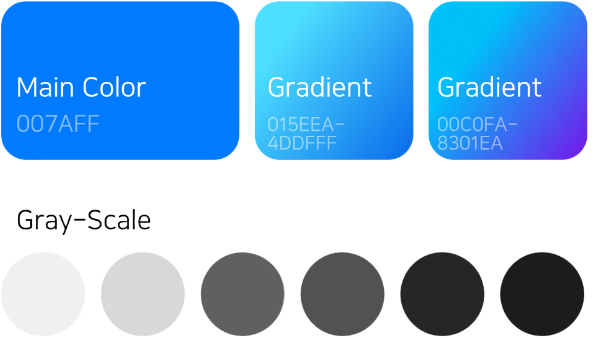 |
| 어플리케이션 구동 환경 | 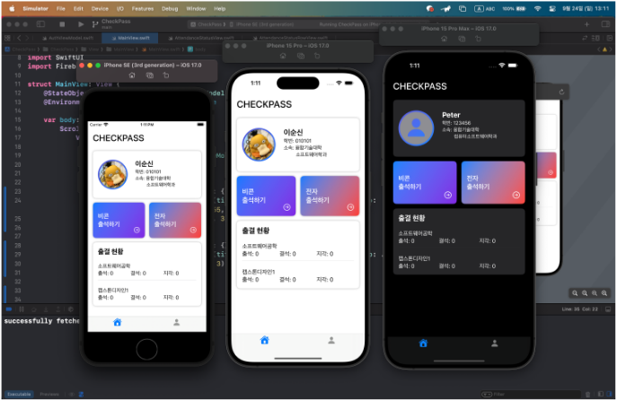 |
| 웹/모바일 UI/UX (1) | 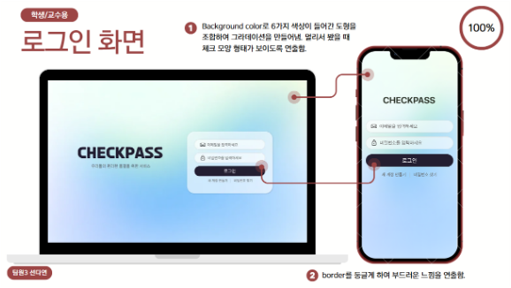 |
| 웹/모바일 UI/UX (2) | 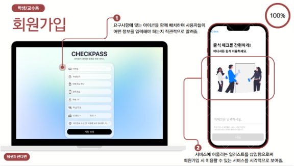 |
| 웹/모바일 UI/UX (3) | 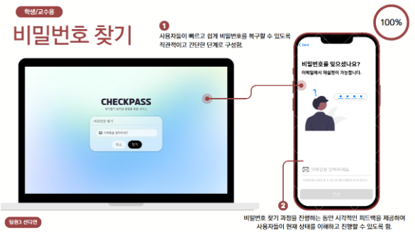 |
| 웹/모바일 UI/UX (4) | 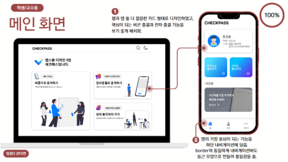 |
| 웹/모바일 UI/UX (5) | 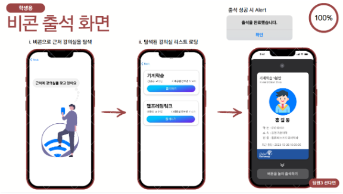 |
| 웹/모바일 UI/UX (6) | 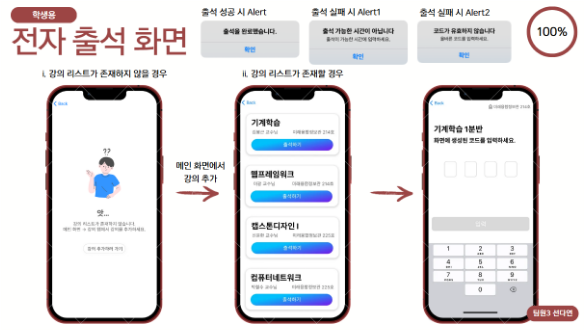 |
| 웹/모바일 UI/UX (7) | 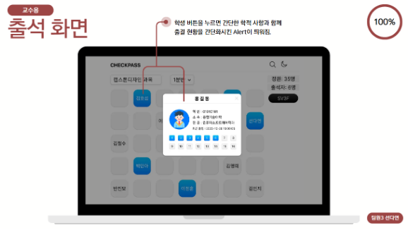 |
| 웹/모바일 UI/UX (8) | 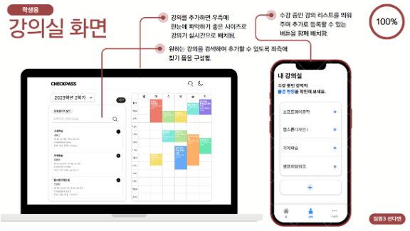 |
| 웹/모바일 UI/UX (9) | 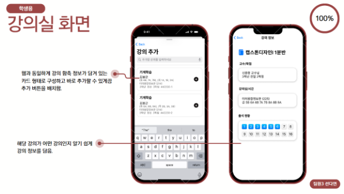 |

## Source

원본: `portfolio.pptx` — Slide 6, Slide 7 (Project / 작업이력 > CHECKPASS)
