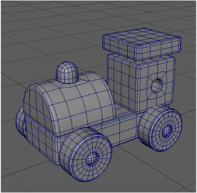
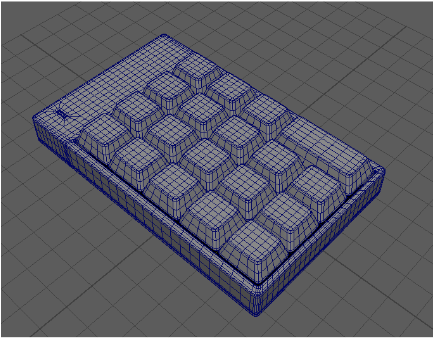
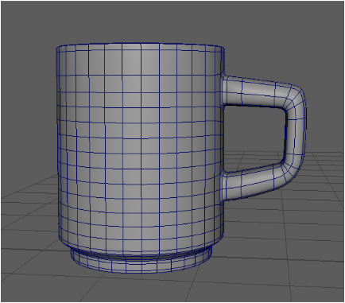
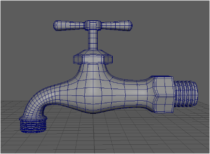
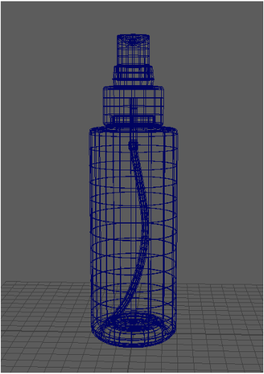
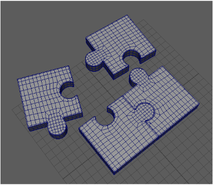
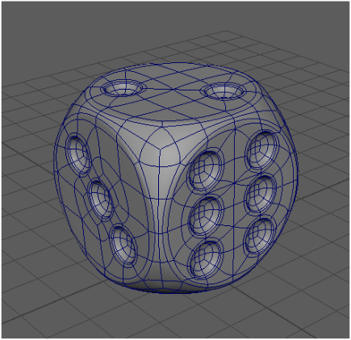
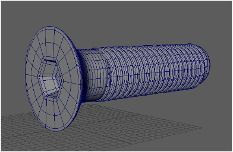

# 3D Modeling — Maya

> Maya를 활용해 다양한 오브젝트를 모델링한 작업 모음.

| 항목 | 내용 |
| --- | --- |
| 구분 | 3D Modeling (Character / Prop) |
| 사용 툴 | Autodesk Maya |
| 태그 | `#3D_Modeling` `#Maya` |

## Summary

Maya를 사용해 캐릭터와 소품 등 다양한 오브젝트를 모델링한 결과물입니다.
폴리곤 위주의 모델링으로 형태와 실루엣을 중심으로 작업했습니다.

## 이미지 갤러리

| | |
| --- | --- |
|  |  |
|  |  |
|  |  |
|  |  |

## Source

원본: `portfolio.pptx` — Slide 8 (Project / Modeling · Maya)
