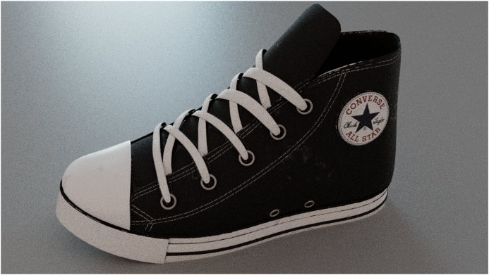
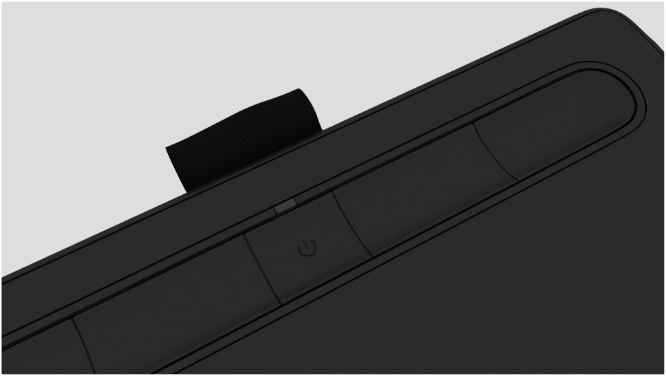
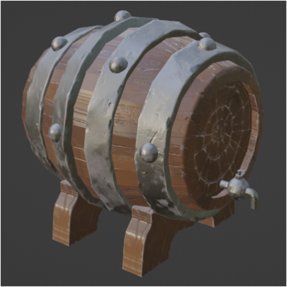
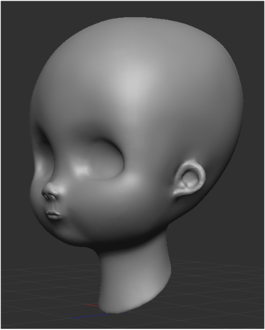
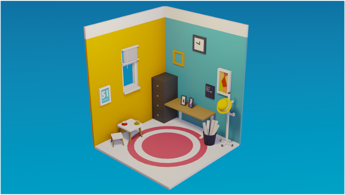
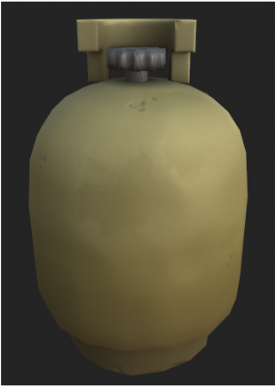

# 3D Modeling — Maya / ZBrush / Blender

> 다중 DCC 툴을 교차 활용해 진행한 3D 모델링 작업 모음.

| 항목 | 내용 |
| --- | --- |
| 구분 | 3D Modeling (Character / Environment) |
| 사용 툴 | Maya, ZBrush, Blender |
| 태그 | `#3D_Modeling` `#Maya` `#ZBrush` `#Blender` |

## Summary

Maya, ZBrush, Blender를 함께 활용해 진행한 모델링 작업입니다.
하드서페이스·오거나닉 등 성격이 다른 오브젝트를 각 툴의 강점에 맞춰 분업했습니다.

## 이미지 갤러리

| | |
| --- | --- |
|  |  |
|  |  |
|  |  |

## Source

원본: `portfolio.pptx` — Slide 9 (Project / Modeling · Maya, ZBrush, Blender)
