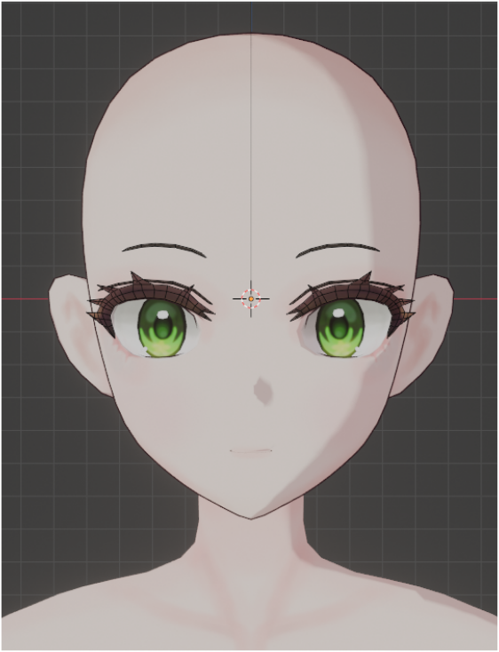
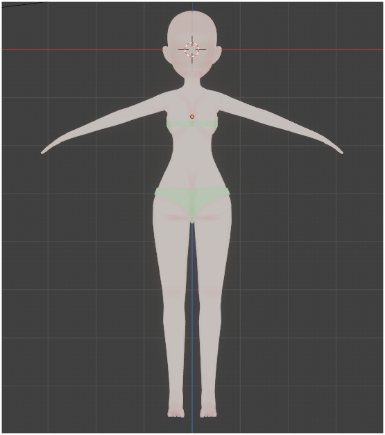
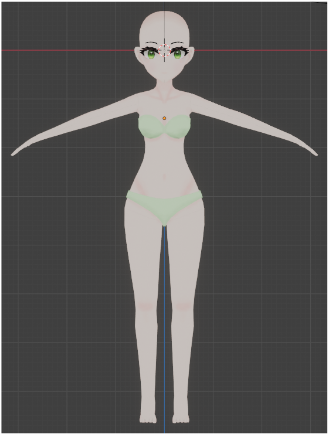
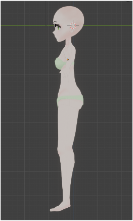
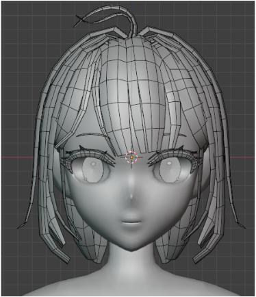
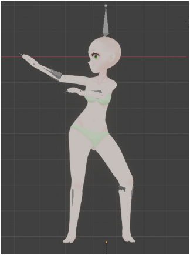

# 3D Modeling — Subculture Style (Blender)

> Blender로 작업한 서브컬쳐풍 캐릭터 모델링.

| 항목 | 내용 |
| --- | --- |
| 구분 | 3D Modeling (Character, Subculture style) |
| 사용 툴 | Blender |
| 태그 | `#3D_Modeling` `#Blender` `#Subculture` |

## Summary

Blender를 사용해 서브컬쳐풍 캐릭터를 모델링한 작업입니다.
스타일라이즈드 캐릭터의 비율감과 표정 연기에 초점을 맞추었습니다.

## 이미지 갤러리

| | |
| --- | --- |
|  |  |
|  |  |
|  |  |

## Source

원본: `portfolio.pptx` — Slide 10 (Project / Modeling · Blender · 서브컬쳐풍)
