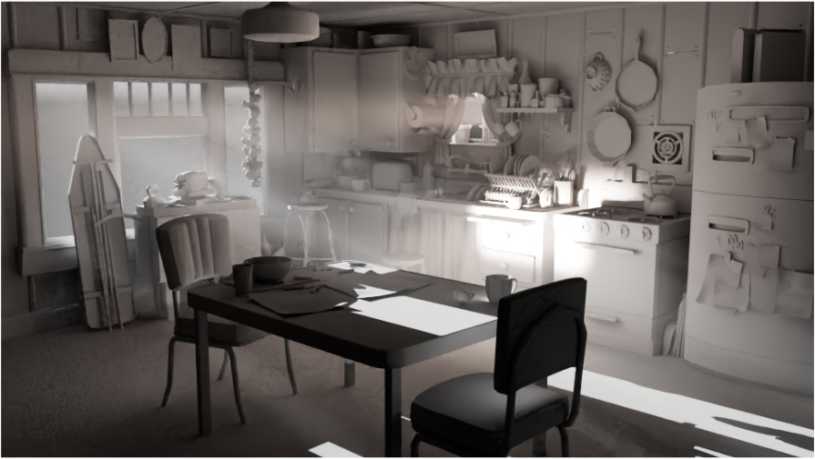
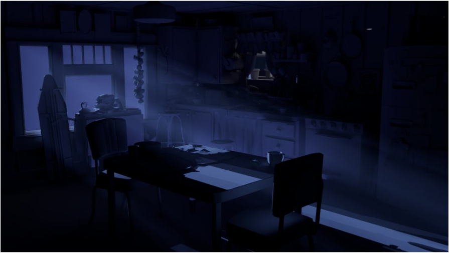

# Lighting & Rendering — Natural / Moonlight

> 자연광과 인공 조명을 대비시킨 인테리어 라이팅 씬.

| 항목 | 내용 |
| --- | --- |
| 구분 | Lighting & Rendering (Interior) |
| 태그 | `#Lighting` `#Rendering` `#3D` |

## Summary

창문을 통해 들어오는 자연광 라이팅과, 창문으로 스며드는 푸른 달빛·어둠 속 분위기를 연출한 라이팅 작업을 비교한 씬입니다.
한 공간 안에서 **광원의 성격이 어떻게 공간의 정서를 결정하는지** 보여주는 것이 핵심 의도입니다.

## 이미지 갤러리

| | |
| --- | --- |
|  |  |

## Source

원본: `portfolio.pptx` — Slide 11 (Project / Lighting & Rendering)
