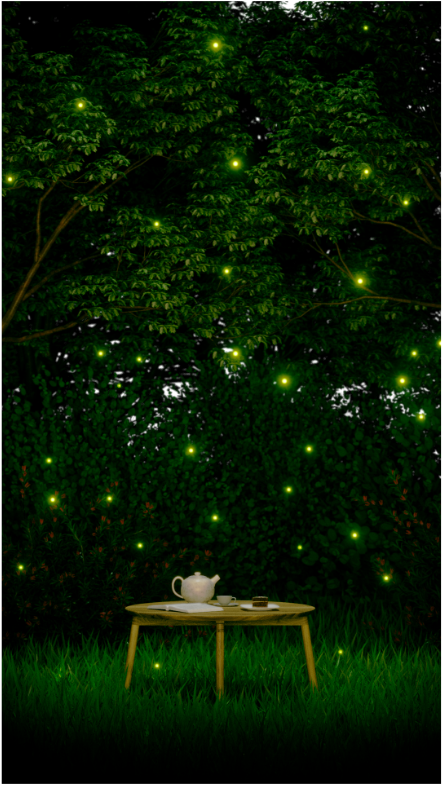
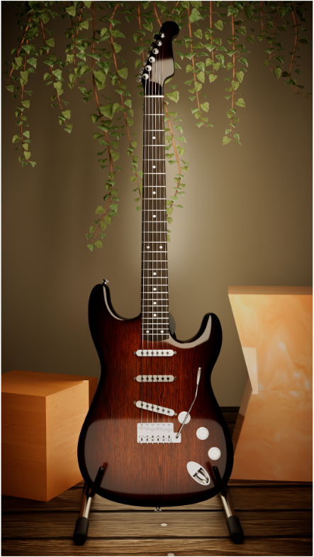
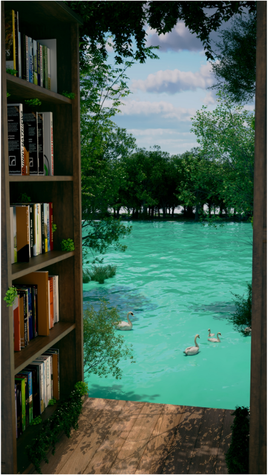

# Lighting & Rendering — Product / Environment

> 일렉기타 프로덕트와 환경 콘셉트 라이팅.

| 항목 | 내용 |
| --- | --- |
| 구분 | Lighting & Rendering (Product, Environment) |
| 태그 | `#Lighting` `#Rendering` `#3D` `#Product` `#Environment` |

## Summary

하드서피스 프로덕트(일렉기타)와 내러티브 환경(반딧불이 정원, 호수가 보이는 책장) 라이팅을 다룬 씬 모음입니다.
광택·반사·간접광 등 **재료의 물성**과 **장소의 분위기**가 어떻게 빛과 반응하는지에 집중했습니다.

## 이미지 갤러리

| | |
| --- | --- |
|  |  |
|  | |

## Source

원본: `portfolio.pptx` — Slide 12 (Project / Lighting & Rendering)
