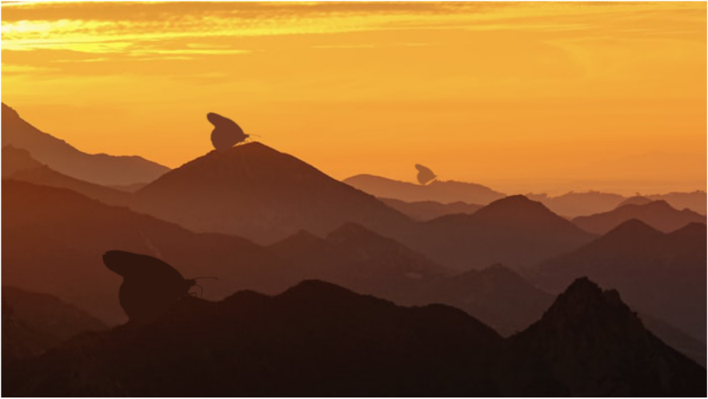
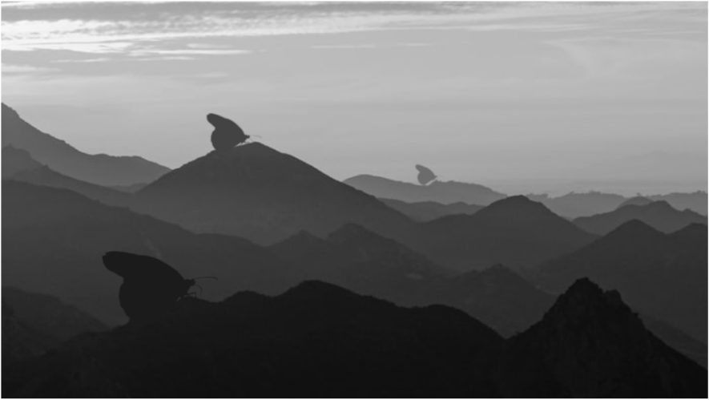

# Compositing — Mountains & Butterfly (Nuke)

> Nuke를 사용한 합성 작업.

| 항목 | 내용 |
| --- | --- |
| 구분 | Compositing |
| 사용 툴 | Nuke |
| 태그 | `#Compositing` `#Nuke` |

## Summary

겹겹이 쌓인 산맥과 거대한 나비 실루엣을 합성한 씬입니다.
레이어 간의 톤 매칭, 마스크 처리, 대기감(원근) 표현에 집중했습니다.

## 이미지 갤러리

| | |
| --- | --- |
|  |  |

## Source

원본: `portfolio.pptx` — Slide 13 (Project / Compositing · Nuke)
