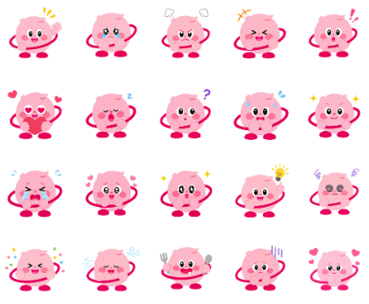
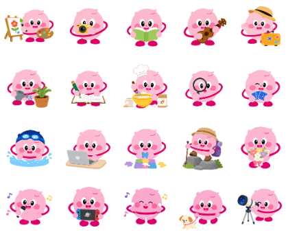
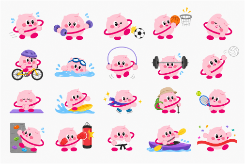
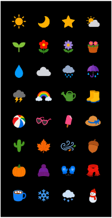
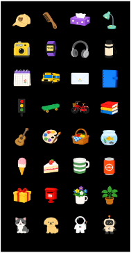
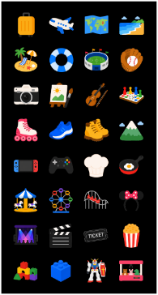
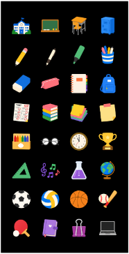
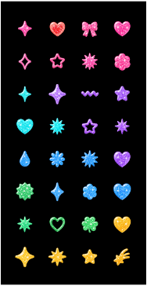
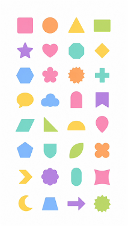
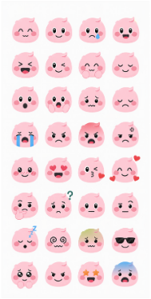

# Simspace Renewal — Visual Asset Design

> AI 이미지 생성과 포토샵 리터칭으로 심스페이스 리뉴얼에 필요한 비주얼 에셋을 만든 프로젝트.

| 항목 | 내용 |
| --- | --- |
| 프로젝트명 | 심스페이스 리뉴얼 개선 프로젝트 |
| 담당 업무 | 신규 이모티콘, 스티커, 테마 기획 및 디자인 |
| 사용 툴 | AI 이미지 생성 플랫폼, Adobe Photoshop |
| 핵심 역량 | 프롬프트 엔지니어링을 통한 아트워크 생성, 디테일 리터칭, UI 환경에 맞춘 에셋 최적화 |
| 태그 | `#Simspace` `#AI_Asset` `#Emoticon` `#Sticker` `#Photoshop` |

---

## 1. 프로젝트 개요

리뉴얼된 심스페이스 플랫폼의 비주얼 아이덴티티에 맞춰 **캐릭터 이모티콘, 다이어리 꾸미기 스티커, 테마** 등 신규 비주얼 에셋을 기획·디자인했습니다.

순수 생성형 AI 결과물이 아닌, **AI로 후보를 확보하고 포토샵으로 서비스 환경에 맞게 마감**하는 것이 이 프로젝트의 핵심 워크플로우입니다.

---

## 2. 작업 프로세스 (Work Flow)

1. **기획 및 프롬프트 통제** — 리뉴얼된 플랫폼의 톤앤매너를 분석하고, 일관된 캐릭터/테마 스타일을 구현하기 위한 AI 프롬프트 설계
2. **AI 에셋 제너레이션** — 의도한 컨셉에 부합하는 원본 이미지 소스를 다수 생성해 최적의 시안 선별
3. **디테일 리터칭** — 포토샵으로 AI 생성 이미지의 형태적 오류 수정, 색조 보정, 외곽선 정리
4. **최종 규격화** — 심스페이스 UI 환경 및 각 디바이스 해상도에 맞춘 배경 투명화 및 리사이징

---

## 3. Sub-Artifact A — Emoticon Design (이모티콘 3종)

### Summary

심스페이스의 **메인 캐릭터 '심스'**를 활용한 이모티콘 패키지 3종(감정 / 취미 / 운동)을 전담 제작했습니다.
사용자의 다양한 커뮤니케이션 니즈를 충족할 수 있도록 다채로운 동작과 상황을 기획했습니다.

### Problem Solving — 일관성 확보와 디테일의 완성

이 프로젝트의 가장 큰 과제는 AI로 생성된 결과물 사이의 **'캐릭터 일관성'**을 유지하는 것이었습니다.

- 수많은 시행착오를 거치며 **최적의 프롬프트**를 설계
- 일정한 톤앤매너를 가진 원본을 추출
- 포토샵으로 AI 특유의 **형태적 오류 보정**과 **픽셀 단위 리터칭**
- 최종적으로 서비스 UI에 자연스럽게 녹아드는 이모티콘 세트를 구축

### 이미지

| 캐릭터 | 이모티콘 |
| --- | --- |
|  |    |

---

## 4. Sub-Artifact B — Sticker Design (스티커 7종)

### Summary

심스페이스 신규 기능 **'다이어리 꾸미기(다꾸)'**에 활용될 스티커 7종(학교 / 날씨 / 일상 / 활동 / 글리터 / 표정 이모지 / 도형)을 전담 기획·제작했습니다.

신규 런칭 기능으로 내부 메뉴얼이 전무한 상황에서, **오프라인 다이어리 스티커 시장을 벤치마킹**해 디지털 환경에 맞는 자체 가이드라인을 신규 수립했습니다.

### Problem Solving — 타겟 맞춤형 에셋 기준 확립

글로벌 에듀테크 서비스의 특성에 맞춰 **디자인의 허용 범위를 설정**하는 것이 가장 큰 과제였습니다.

- 국내 유저에게만 익숙한 **로컬 요소 제거**
- 논란의 여지가 있는 요소 **과감히 배제**
- 전 세계 학생들이 일상에서 자주 활용할 수 있는 **보편적이고 안전한 오브젝트**만 엄선
- 글로벌 스탠다드에 부합하는 높은 완성도의 에셋으로 마감

### 이미지

| 스티커 (7종) |
| --- |
|        |

---

## Source

원본: `portfolio.pptx` — Slide 14 (오버뷰), Slide 15 (이모티콘), Slide 16 (스티커)
