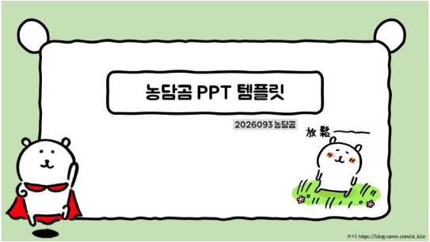
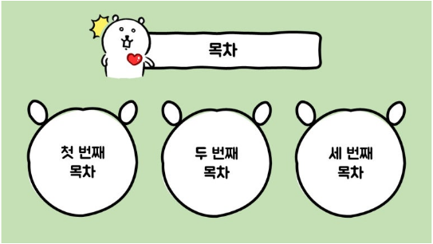
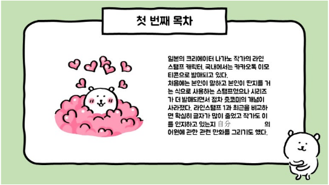
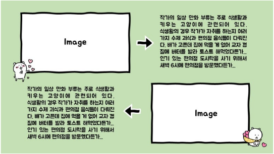
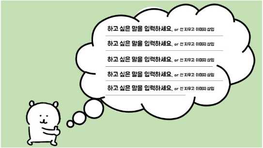
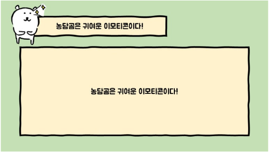
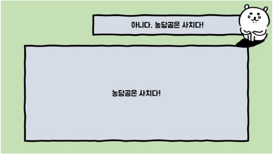
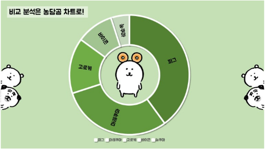
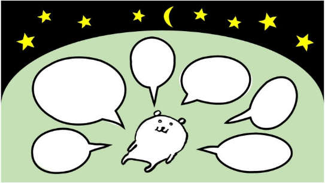

# Template Design — '농담곰' PPT 템플릿

> 캐릭터 '농담곰'을 주제로 한 PPT 템플릿을 디자인하고 블로그에 배포한 작업.

| 항목 | 내용 |
| --- | --- |
| 구분 | Template Design (블로그 배포) |
| 사용 툴 | PowerPoint / 디자인 툴 |
| 태그 | `#Template` `#Character_Brand` `#Distribution` |

## Summary

'농담곰' 캐릭터를 메인으로 활용한 **PPT 템플릿 디자인**을 제작해 블로그를 통해 배포한 프로젝트입니다.
단순 템플릿이 아니라, 캐릭터 브랜드가 일관되게 녹아든 사용 경험(라이센스·레이아웃·일러스트)을 구축하는 것이 목표였습니다.

## 이미지 갤러리

| | | |
| --- | --- | --- |
|  |  |  |
|  |  |  |
|  |  |  |

## Source

원본: `portfolio.pptx` — Slide 17 (Project / Template Design)
