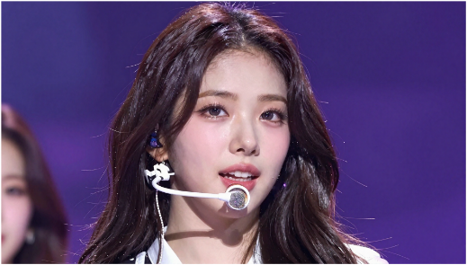

# AI Image Generation — Z-Image-Turbo (ComfyUI)

> ComfyUI + Z-Image-Turbo 모델로 텍스트만으로 이미지를 생성한 작업 모음.

| 항목 | 내용 |
| --- | --- |
| 구분 | AI Image Generation |
| 사용 툴 | ComfyUI, Z-Image-Turbo 모델 |
| 태그 | `#AI_Image` `#ComfyUI` `#Z_Image_Turbo` `#Prompt_Engineering` |

## Summary

**Z-Image-Turbo** 모델을 사용하고, **ComfyUI** 프로그램을 통해 텍스트 프롬프트만으로 다양한 이미지를 생성한 결과물입니다.
프롬프트 엔지니어링을 통해 의도한 스타일과 콘텐츠를 안정적으로 뽑아내는 것이 핵심 역량입니다.

## 이미지 갤러리

| | | | |
| --- | --- | --- | --- |
|  |  |  |  |
|  |  |  |  |

## Source

원본: `portfolio.pptx` — Slide 18 (Project / AI Image · ComfyUI)
